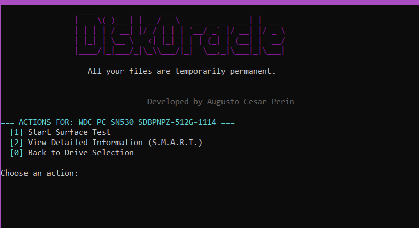
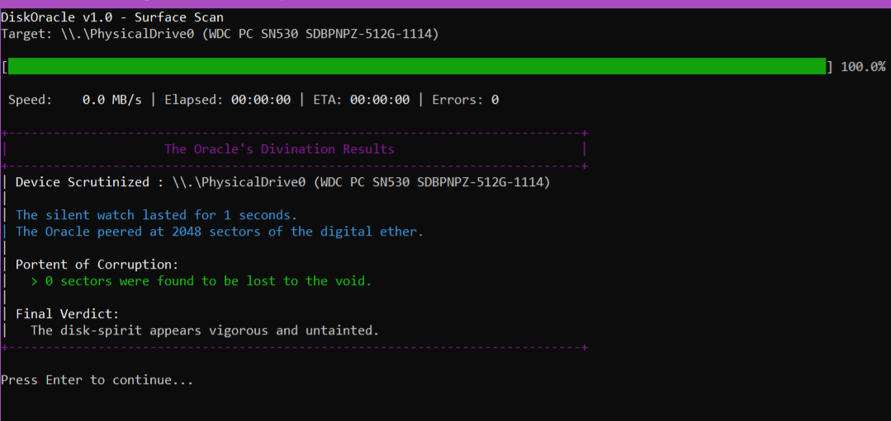

A low-level C utility for diagnostics on ATA and NVMe drives.



## Features

*   Lists all physical storage devices.
*   Reads and displays full S.M.A.R.T. data tables.
*   Analyzes critical attributes to provide diagnostic recommendations.

    

*   Performs read-only surface scans to detect bad sectors.

## Use

Run with Administrator privileges.

**Interactive Mode:** Run `diskoracle` with no arguments for a menu.

**Direct Commands:** Use flags for specific actions.


 `--list`

  `--smart <device>`

  `--surface <device>`


## Build

Requires `CMake` and a C compiler (MinGW/GCC).
```shell
mkdir build && cd build
cmake ..
make
```
